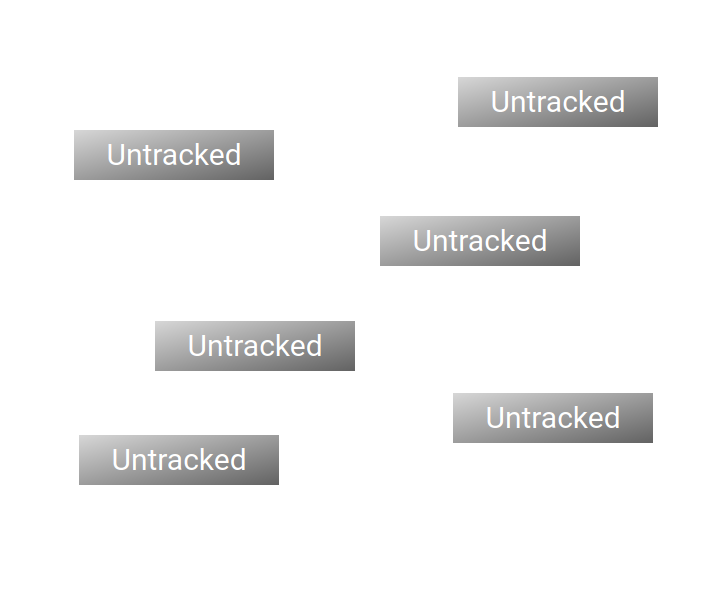
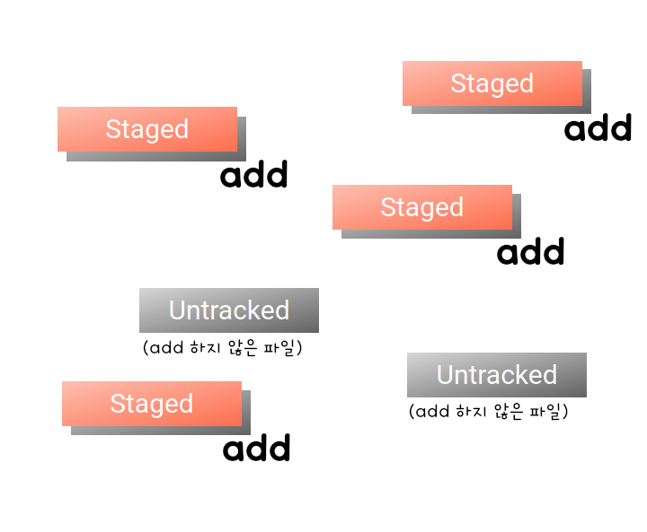
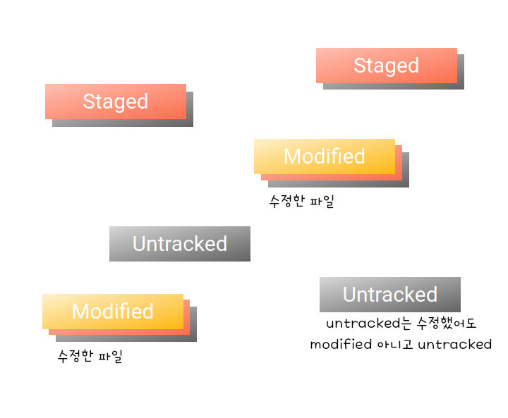
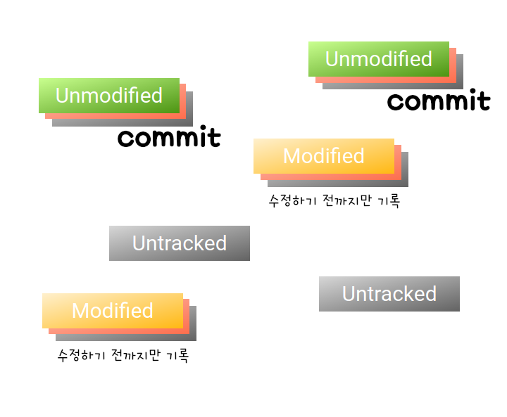
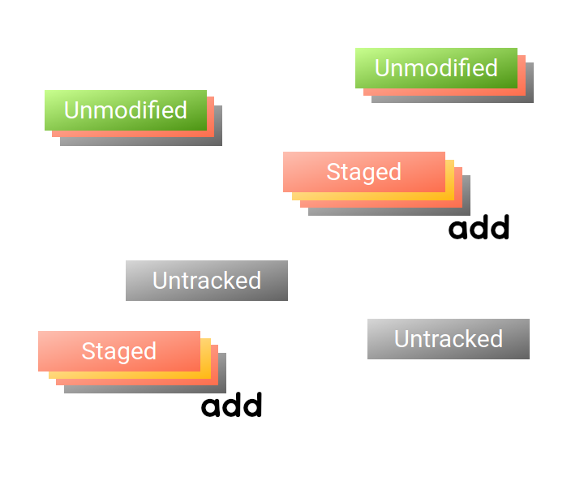
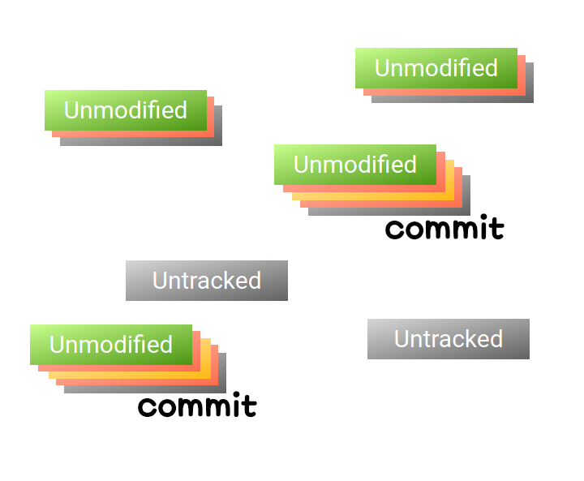
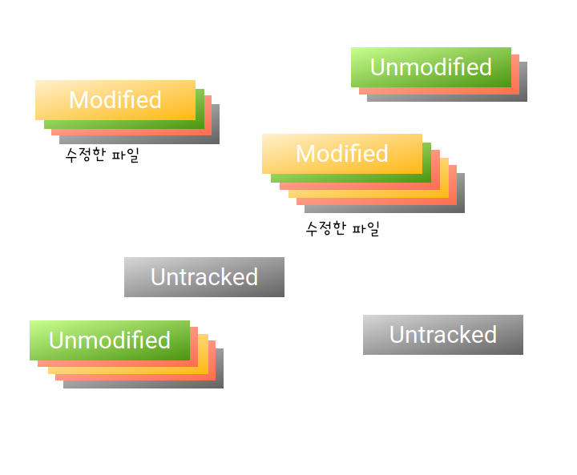
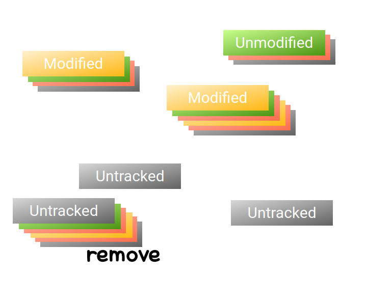
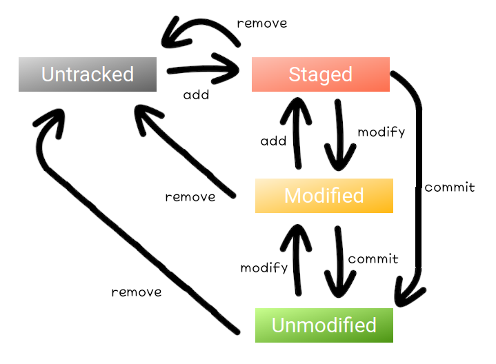

Git 저장소 파일의 상태
===

Git 저장소 디렉토리의 파일이 가지고 있을 수 있는 세 가지 상태에 대해 알아보겠다.    
이 장에서는 **아직 실습을 하지 않을 것**이니 터미널은 잠시 넣어놓고 이론적인 부분에 집중하자.

Git 저장소
---

어떤 디렉토리를 Git 저장소 디렉토리로 만들기 위해서는 "여기서부터 하위 디렉토리들이 프로젝트 디렉토리다"라는 것을 알려야 한다.    
프로젝트의 루트 디렉토리에서 Git 저장소 디렉토리를 만드는 명령어를 사용하면 그곳이 프로젝트 루트임을 알리는 특별한 디렉토리가 생성된다.    
그것은 `.git`이라는 이름을 갖고 있으며, 해당 Git 저장소의 모든 정보는 이 디렉토리 안에 저장되니 실수로라도 삭제하지 않도록 주의하자.

Git 저장소 디렉토리를 만드는 방법은 두 가지가 있다.

- (init) 새로운 디렉토리를 생성하고 새로운 프로젝트를 위한 Git 저장소를 생성한다.
- (clone) 기존에 존재하는 프로젝트의 Git 저장소를 내려 받아 프로젝트를 이어서 진행한다.

각각의 방법은 [다음 시간](chapter03.md)에 알아보도록 하고, 지금은 그냥 그런 게 있구나 하는 정도로 넘어가자.

파일의 상태
---

Git은 Git 저장소 디렉토리에 있는 파일을 관리하지만 그곳에 있는 *모든* 파일을 관리하지는 않는다.    
오직 staging area라는 개념적인 공간에 올라가 있는 파일만을 관리한다.    

처음 파일을 생성하면 그것은 **Untracted** 상태로 만들어진다.    
Git이 추적하고 있지 않은 상태를 의미하며, 이 파일은 staging area에 올라가 있지 않아 이 상태를 Unstaged라고도 한다.

Untracked 상태의 파일을 staging area에 추가(add)하면 파일의 상태가 **Staged**로 변경된다.

Staged 상태인 파일은 Git을 통해 스냅샷을 찍을 수 있다.    
즉, staging area에 파일을 추가해야만 Git을 통해 변동 사항을 기록할 수 있는 것이다.

Staged 상태의 파일을 Git에 기록하기 전에 수정할 경우 그 파일의 상태는 **Modified**가 된다.

변동 사항을 Git에 기록하면 기록된 파일의 상태는 **Unmodified**가 된다.    
Git에서는 이 기록을 commit이라고 부른다.
여기서 주의할 점은, Git은 파일의 최신 상태가 아니라 마지막으로 Staged였던 상태를 기억한다는 것이다.    

파일이 Modified된 상태로 commit할 경우 마지막으로 staging area에 추가(add)한 이후의 변동 사항은 기록되지 않는다.    

만약 그 내용까지 기록하고 싶다면 Modified 상태의 파일을 다시 staging area에 추가(add)하여 Staged 상태로 만들어야 한다.

그리고 commit을 통해 Unmodified가 된 파일에 수정을 가하면 그 상태는 Modified로 바뀐다.

어떤 파일에 대하여 더 이상 Git을 통해 추적하지 않고 Git 저장소에서 제거하고자 한다면 staging area에서 제거(remove)하면 된다.    

이 과정을 도식화하면 다음과 같다.

이를 당장 외우려고 하기 보다는 [다음 시간](chapter03.md)에 다룰 명령어와 함께 익숙해지도록 하자.    
[>>> 03. Git 저장소 파일의 상태 실습](chapter03.md)
