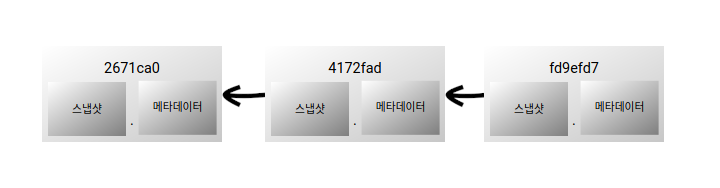
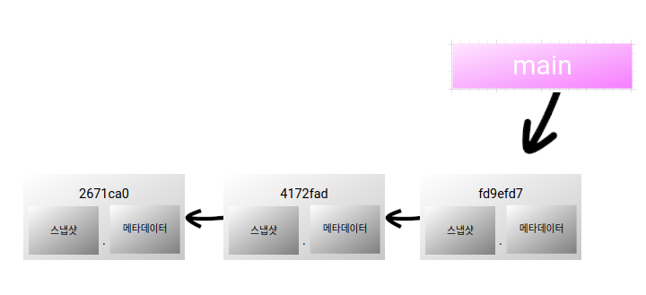
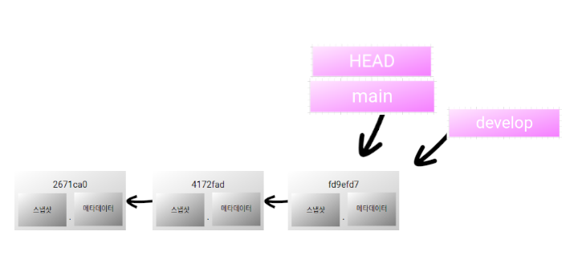
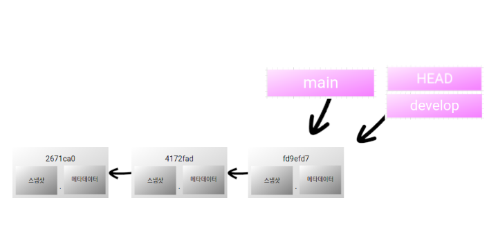
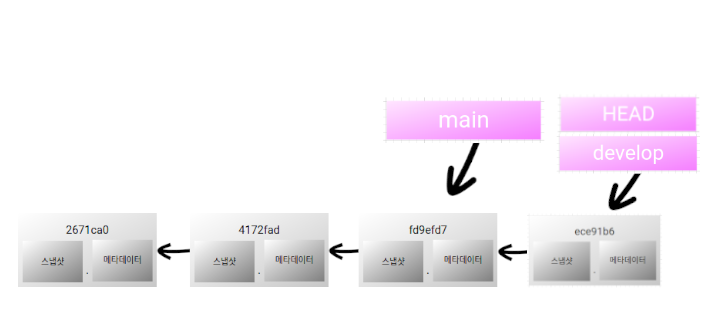
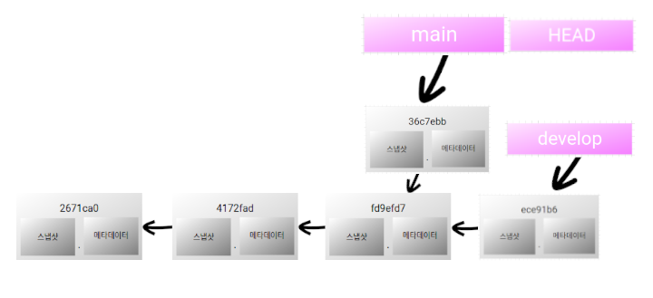

branch란 무엇인가
===

Git은 파일의 변동사항을 스냅샷으로 기록한다.    
commit을 하면 Commit Object라는 것이 만들어지며 여기엔 현재 staging area에 있는 데이터의 스냅샷, 메타데이터, 이전 commit에 대한 포인터 등이 저장된다.



포인터의 경우 하나일 수도 있고 여러 개일 수도 있는데, Git 저장소의 첫번째 commit의 경우 포인터를 갖지 않으며 그 이후 commit들은 이전 commit을 포인터로 가지며, 조만간 알게 될 merge commit이라는 특별한 commit은 포인터를 여러 개 갖는다.

메타데이터에는 누가 commit을 하였고 언제 하였는지 등의 정보가 포함된다.    

이와 관련된 내용은 자세히 모르더라도 Git을 사용하는 데 어려움을 느끼진 않겠지만 보다 자세히 이해하고 넘어가고 싶다면 [공식 문서](https://git-scm.com/book/ko/v2/Git-브랜치-브랜치란-무엇인가)를 참고하도록 하자.

commit을 하는 행위뿐만 아니라 Commit Ojbect 또한 commit 이라고 부르기도 하는데, 여기서도 동사형과 명사형을 혼용할 것이다.

자, 그럼 이제 본격적으로 branch에 대한 이야기를 하겠다.

branch
---

branch는 commit을 가리키는 포인터라고 볼 수 있다.    
[01. Git 설치 및 초기 설정](chapter01.md)에서도 잠깐 이야기가 나왔지만 Git 저장소는 기본적으로 `main` (혹은 `master`)라는 이름의 branch를 생성하는데, 따라서 새로 생성된 Git 저장소에 별다른 조작 없이 commit을 하면 `main` branch가 이 첫번째 commit을 가리키게 된다.


그리고 새로 commit을 할 때마다 `main` branch는 자동으로 마지막 commit으로 이동한다.



branch는 다음과 같은 명령어로 추가할 수 있다.

```bash
$ git branch <Branch Name>
```

`develop` 라는 이름의 branch를 생성한다면 다음과 같다.

```bash
git-example$ git branch develop
```

생성된 branch는 현재 작업 중인 branch와 동일한 commit을 가리킨다.    
로그를 출력해보면,

```bash
git-example$ git log
commit fd9efd7a492118519f2ca30f4bb690dfd747a669 (HEAD -> main, develop)
Author: Pt J <peter.j@kakao.com>
Date:   Mon Feb 15 00:22:47 2021 +0900

    Test modify

commit 4172fad95f508e7bc63c6167fd870522d686e58f
Author: Pt J <peter.j@kakao.com>
Date:   Mon Feb 15 00:02:54 2021 +0900

    modified

commit 2671ca0ae1f5c2af61d642044ae6e81d320c614f
Author: Pt J <peter.j@kakao.com>
Date:   Sun Feb 14 19:55:21 2021 +0900

    Initial Commit
```

마지막 commit 옆에 `(HEAD -> main, develop)` 라고 적혀 있는 것을 볼 수 있다.    
여기서 `HEAD` 는 현재 작업 중인 branch를 나타낸다.



작업 중인 branch를 옮기고 싶다면 다음과 같은 명령어를 사용할 수 있다.

```bash
$ git checkout <Branch Name>
```

조금 전에 만든 `develop` branch로 이동할 땐,

```bash
git-example$ git checkout develop
Switched to branch 'develop'
```

명령어 수행 후 다시 로그를 출력해보면,

```bash
git-example$ git log
commit fd9efd7a492118519f2ca30f4bb690dfd747a669 (HEAD -> develop, main)
Author: Pt J <peter.j@kakao.com>
Date:   Mon Feb 15 00:22:47 2021 +0900

    Test modify

commit 4172fad95f508e7bc63c6167fd870522d686e58f
Author: Pt J <peter.j@kakao.com>
Date:   Mon Feb 15 00:02:54 2021 +0900

    modified

commit 2671ca0ae1f5c2af61d642044ae6e81d320c614f
Author: Pt J <peter.j@kakao.com>
Date:   Sun Feb 14 19:55:21 2021 +0900

    Initial Commit
```
 


`HEAD` 가 가리키는 게 `main` 에서 `develop` 로 바뀐 것을 확인할 수 있다.    
여담으로, `git checkout` 명령어에 `-b` 플래그를 사용하면 branch 생성과 함께 그 branch로 옮겨 갈 수 있다.


```bash
$ git checkout -b <Branch Name>
```

그리고 현재 존재하는 모든 branch를 확인하기 위해서는 `git branch` 명령어를 사용할 수 있다.

```bash
git-example$ git branch
* develop
  main
```

여기서 `*` 이 붙은 것이 현재 branch다.

이제 작업 branch가 `main` 이 아닌 `develop` 이므로, 새로 commit을 하면 `main` 이 아닌 `develop` 이 새 commit을 따라 움직인다.    
이를 확인하기 위해 새 파일을 만들어 commit 해보자.

```bash
git-example$ touch newfile
git-example$ git add newfile
git-example$ git commit -m "Add newfile"
[develop ece91b6] Add newfile
 1 file changed, 0 insertions(+), 0 deletions(-)
 create mode 100644 newfile
git-example$ git log
commit ece91b6a71531d04e4d7ab36c827b9289d06a9dd (HEAD -> develop)
Author: Pt J <peter.j@kakao.com>
Date:   Tue Feb 23 19:48:26 2021 +0900

    Add newfile

commit fd9efd7a492118519f2ca30f4bb690dfd747a669 (main)
Author: Pt J <peter.j@kakao.com>
Date:   Mon Feb 15 00:22:47 2021 +0900

    Test modify

commit 4172fad95f508e7bc63c6167fd870522d686e58f
Author: Pt J <peter.j@kakao.com>
Date:   Mon Feb 15 00:02:54 2021 +0900

    modified

commit 2671ca0ae1f5c2af61d642044ae6e81d320c614f
Author: Pt J <peter.j@kakao.com>
Date:   Sun Feb 14 19:55:21 2021 +0900

    Initial Commit
```



현재 Git 저장소 디렉토리에는 `testfile` 과 `newfile` 이 존재한다.

```bash
git-example$ ls
newfile  testfile
```

그런데 `main` branch는 이보다 하나의 commit이 뒤쳐져 있어 `testfile` 만을 가지고 있다.    
실제로 `git checkout` 명령어를 통해 `main` branch를 작업 branch로 지정하면,

```bash
git-example$ git checkout main 
Switched to branch 'main'
git-example$ ls
testfile
```

`testfile` 만 존재하는 것을 확인할 수 있다.

만약 여기서 `newfile` 이라는 이름의 파일을 새로 만든다면 그것은 `develop` branch의 commit과 별개의 commit으로 생성된다.    
동일한 내용의 commit이라도 commit을 한 시간 등의 차이로 해시 값이 달라지기 때문에 서로 구분된다.

```bash
git-example$ git add newfile 
git-example$ git commit -m "Add newfile to main"
[main 36c7ebb] Add newfile to main
 1 file changed, 0 insertions(+), 0 deletions(-)
 create mode 100644 newfile
git-example$ git log --all --graph 
* commit 36c7ebb1de4b6f00f11b616a71348f5e8f226007 (HEAD -> main)
| Author: Pt J <peter.j@kakao.com>
| Date:   Tue Feb 23 21:58:02 2021 +0900
| 
|     Add newfile
|   
| * commit ece91b6a71531d04e4d7ab36c827b9289d06a9dd (develop)
|/  Author: Pt J <peter.j@kakao.com>
|   Date:   Tue Feb 23 19:48:26 2021 +0900
|   
|       Add newfile
| 
* commit fd9efd7a492118519f2ca30f4bb690dfd747a669
| Author: Pt J <peter.j@kakao.com>
| Date:   Mon Feb 15 00:22:47 2021 +0900
| 
|     Test modify
| 
* commit 4172fad95f508e7bc63c6167fd870522d686e58f
| Author: Pt J <peter.j@kakao.com>
| Date:   Mon Feb 15 00:10:30 2021 +0900
| 
|     modified
| 
* commit 2671ca0ae1f5c2af61d642044ae6e81d320c614f
  Author: Pt J <peter.j@kakao.com>
  Date:   Sun Feb 14 19:55:21 2021 +0900
  
      Initial Commit

```

`git log` 에 `--all` 플래그를 설정하면 다른 branch의 commit log까지 확인할 수 있으며 `--graph` 플래그를 설정하면 동일 commit으로부터 파생된 branch를 시각적으로 확인할 수 있다.    
그리고 부가 정보가 많아 한 눈에 알아보기 어렵다면 `--oneline` 플래그를 통해 commit 당 한 줄로 요약해서 볼 수도 있다.    

```bash
git-example$ git log --all  --graph --oneline 
* 36c7ebb (HEAD -> main) Add newfile
| * ece91b6 (develop) Add newfile
|/  
* fd9efd7 Test modify
* 4172fad modified
* 2671ca0 Initial Commit
```
 
이로써 `develop` 과 `main` 브랜치에서 각각 빈 파일 `newfile` 을 생성하였고 두 commit은 메시지까지 동일하지만 서로 다른 해시 값을 가진 별개의 commit으로 생성되었음을 알 수 있다.



또한, 앞서 `git branch` 를 통해 branch를 확인할 수 있다고 했는데, 여기에 `-v` 플래그를 설정하면 각각의 branch의 마지막 commit을 확인할 수 있다.

```bash
git-example$ git branch -v
  develop ece91b6 Add newfile
* main    36c7ebb Add newfile
```

branch를 삭제하고자 한다면 다음 명령어를 사용할 수 있다.

```bash
$ git branch -d <Branch Name>
```

이 때, 삭제하고자 하는 branch는 다른 branch에 합병되어 있어야 하는데, 어떻게 합병하는지는 [이후](chapter06.md)에 알아보도록 하고, 지금은 branch에 집중하도록 하자.

합병되지 않은 branch를 삭제하고자 한다면 `-d` 플래그 대신 `-D` 플래그를 사용할 수 있다.

branch의 용도
---

자, 그렇다면 이런 branch는 언제 왜 사용하는가.    
branch를 사용하면 여러 기능을 동시에 구현할 때 유용하다.

Git을 통해 프로젝트를 관리할 때 어떤 기능을 구현하다가 "아 삽질 너무 많이 했다. 차라리 지난 commit부터 다시 작성하는 게 낫겠어." 하며 이전 commit 상태로 되돌릴 수 있다.    
그런데 독립적인 여러 기능을 동시에 구현하고 있을 경우 그 중 하나만 되돌리고 싶어도 그게 쉽지 않다.    
하지만 만약 각각의 기능을 서로 다른 branch에서 구현하고 있었다면 되돌리고 싶은 branch만 이전 commit으로 되돌릴 수 있다.    
특히 다른 사람과 협업을 할 경우 각자의 branch에서 구현하고 하나의 코드로 합병하면 효과적인 개발을 할 수 있다.     

물론 기능마다 서로 다른 파일에 구현되고 있었다면 특정 파일만 마지막 commit 상태로 되돌릴 수 있긴 하다.    
다음과 같은 명령어를 사용하는 것이다.

```bash
$ git checkout -- <File Name>
```

하지만 서로 다른 기능이 같은 파일을 건드릴 수 있으니, 이왕이면 기능 별로 branch를 나누도록 하자.

workflow
---

branch를 어떻게 관리하는지는 기업이나 집단, 프로젝트마다 차이가 있지만 기본적인 workflow는 크게 다르지 않다.    

- `main` (혹은 `master`)    
기본 branch로, 배포 가능한 상태를 유지한다.
- `develop` (혹은 `next`)    
`main` 에서 파생된 branch로, 개발을 진행하고 안정화하며 충분한 테스트를 거쳐 안정적이라고 판단되면 `main` 에 합병한다. (합병 후에도 branch 유지)
- `feature` (혹은 `topic`)    
`develop` 에서 파생된 branch로, 독립적인 한 가지 주제나 작업을 위해 만들어지며 순서에 상관 없이 해당 작업이 완료되면 `develop` 에 합병한다. (합병 후에는 branch 제거 가능)
- `hotfix`    
간혹 `main` 에 올렸는데 치명적인 오류가 발생할 경우 급하게 해결하기 위해 `main` 에서 파생된 branch로, 문제가 해결되면 `main` 과 `develop` 양쪽에 합병한다. (합병 후에는 branch 제거 가능)

<이미지 출처: https://git-scm.com/book/ko/v2/Git-브랜치-브랜치-워크플로 >
[](https://git-scm.com/book/ko/v2/Git-브랜치-브랜치-워크플로)

경우에 따라서는 `main` 과 `develop` 사이에 `release` 가 존재하는 등 더 많은 branch를 사용하는 경우도 있고, branch를 나누지 않고 `main` 만 사용하는 경우도 있는 등 "반드시 이렇게 해야 한다"고 정해져 있는 것은 없다.

다음 시간에는 다른 곳에 있는 저장소와 소통하는 방법을 알아보겠다.    
[>>> 05. remote 저장소와 local 저장소](chapter05.md)

