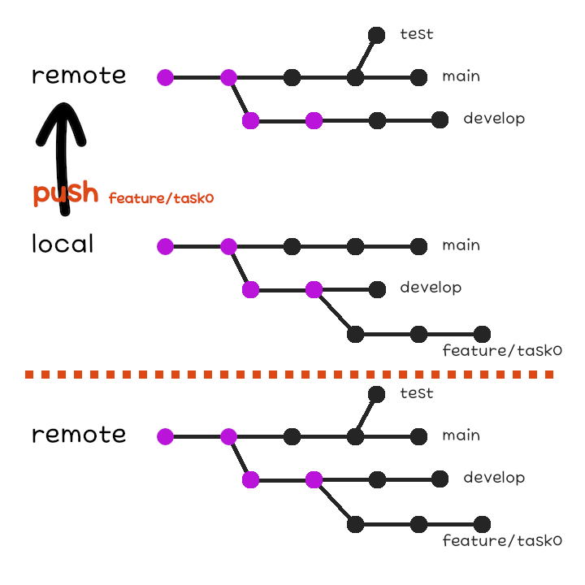
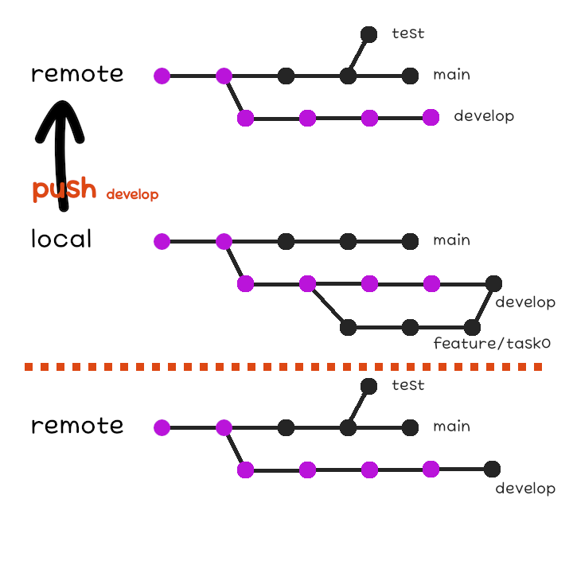
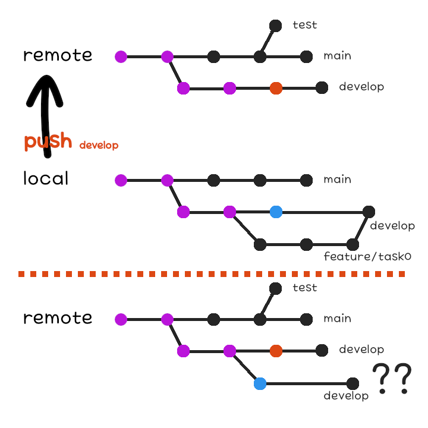

remote 저장소와 local 저장소
===

지금까지 우리가 본 것들은 local PC에서의 작업들이었다.    
그런데 다른 사람과 협업하기 위해서는 외부와의 통신이 필요하다.    
Git은 분산 버전 관리 시스템이라고 했는데, 그렇다면 분산되어 있는 다른 저장소와 어떻게 소통할 수 있을까?

remote 저장소
---

분산 버전 관리 시스템의 원격지에 있는 저장소를 remote 저장소라고 하며 이와 구분하여 local PC의 저장소는 local 저장소라고 한다.    
local 저장소에서는 remote 저장소로 특정 branch가 가리키고 있는 commit까지의 내용을 보내거나 받을 수 있다.    
이 때, 모든 commit이 전달되는 게 아니라 기존에 가지고 있지 않은 commit만 전달되어 비효율적인 통신을 방지한다.

일반적으로 Git 저장소의 원활한 관리를 위해 Git 호스팅 업체의 웹사이트에 remote 저장소를 생성하여 사용하는 경우가 많다.    
대표적으로는 [GitHub](https://github.com), [GitLab](https://gitlab.com), [BitBucket](https://bitbucket.org) 등의 Git 호스팅 업체가 있다.    
이런 호스팅 업체를 이용함으로써 공신력 있는 서버에 Git 저장소를 백업해둘 수 있으며, 자신의 IP를 공개하지 않고도 다른 사람들과 협업할 수 있다.    

현재 local 저장소에 Git 호스팅 업체의 remote 저장소를 연결하면 저장소끼리 소통이 가능해진다.    
이 때, 두 저장소는 첫 번째 commit이 동일하거나, 둘 중 하나는 commit이 존재하지 않아야 한다.    
사실 local 저장소에 commit이 존재하지 않을 때 remote 저장소에서 데이터를 가져오는 것에 대해서는 이미 알아본 적 있다.    
바로 [03. Git 저장소 파일의 상태 실습](chapter03.md)에서 살펴본 `git clone` 이다.
그리고 Git 호스팅 업체에 remote 저장소를 생성해 local 저장소의 데이터를 처음으로 올리는 상황이 remote 저장소에 commit이 존재하지 않는 경우다.

`git clone` 을 한 경우에는 자동으로 remote 저장소가 연결된다.    
이 때 내려 받은 remote 저장소는 기본적으로 `origin` 이라는 이름으로 저장된다.    
remote 저장소의 데이터를 내려 받은 local 저장소에서 `git remote` 명령어를 사용해보면 그 이름을 확인할 수 있으며, `-v` 플래그를 설정할 경우 remote 저장소의 URL도 확인할 수 있다.

예를 들어, GitHub에 있는 [1982kca/how-to](https://github.com/1982kca/how-to) 저장소를 내려받았다면 다음과 같은 결과를 확인할 수 있을 것이다.

```bash
$ git remote
origin
```

```bash
how-to$ git remote -v
origin	https://github.com/1982kca/how-to.git (fetch)
origin	https://github.com/1982kca/how-to.git (push)
```

https://github.com/1982kca/how-to.git 라는 remote 저장소가 `origin` 이라는 이름으로 존재하며, 데이터를 내려 받는 것과 보내는 것 모두 가능하다는 것을 나타낸다.    
Git 호스팅 업체 도메인 뒤에 붙는 `1982kca/how-to.git`은 `<username>/<repository name>.git` 형태로, 해당 Git 호스팅 업체 웹사이트에 존재하는 각각의 저장소를 식별하는 데 사용된다.

실습을 수행한 local 저장소를 Git 호스팅 업체의 remote 저장소에 올리고 싶다면 먼저 Git 호스팅 업체 웹사이트에서 사용자 계정을 만들고 비어 있는 Git 저장소를 만들어야 한다.    
그리고 local 저장소에서 다음과 같은 명령어를 통해 remote 저장소를 추가할 수 있다.

```bash
$ git remote add <Remote Name> <Remote URL>
```

`git clone` 시 `-o` 플래그로 설정해주지 않는다면 remote 저장소의 기본 이름이 `origin` 인 것에 따라 여기서도 `origin` 이라는 이름으로 추가한다면,

```bash
git-example$ git remote add origin https://github.com/<username>/<repository name>.git
```

여기서 `<username>` 과 `<repository name>` 은 각자 Git 호스팅 업체 웹사이트에서 설정한대로 입력하면 된다.    
물론, GitHub이 아니라 다른 곳을 사용했다면 도메인도 그것으로 입력하도록 하자.

혹시라도 remote 저장소를 제거하거나 이름을 변경하고 싶다면 이를 위한 명령어도 존재한다.

이름을 바꿀 땐

```bash
$ git remote rename <Remote Name> <New Remote Name>
```

그리고 제거할 땐

```bash
$ git remote remove <Remote Name>
```

을 사용할 수 있다.

push, fetch, 그리고 pull
---

지금까지 local 저장소에 기록해놓은 commit을 remote 저장소에 공유하고 싶다면 `git push` 명령어를 사용한다.    
아무 commit이나 공유할 수 있는 건 아니고, 어떤 remote 저장소에 어떤 branch를 공유할지 지정하면 첫번째 commit부터 해당 branch가 가리키는 commit까지 중 해당 remote 저장소에 존재하지 않는 부분이 전송된다.    
remote 저장소가 비어 있는 경우라면 상관 없지만, 만약 remote 저장소에 commit이 존재할 경우 주의해야 할 점이 있다.    
같은 이름을 가진 branch가 없을 경우 첫번째 commit부터 한 개 이상의 commit이 일치하기만 하면 마지막으로 일치하는 commit에서부터 분기되어 나온 것으로 취급된다.    



같은 이름을 가진 branch가 있을 경우, remote 저장소의 branch가 local 저장소의 첫번째 commit부터 branch까지의 경로 상에 있어야 한다.    
그렇지 않을 경우, remote 저장소와 local 저장소의 내용 중 무엇을 따라야 할 지 알 수 없기 때문이다.





이와 같이 어느 것을 따라야 할지 알 수 없는 모호한 상황이 발생하는 것을 충돌(conflict)이라고 한다.    
충돌은 피할 수 있으면 피하는 게 좋긴 하지만 때로는 어쩔 수 없는 상황이 발생할 수 있다.    
이런 경우에 어떻게 해야 하는지는 [다음 시간](chapter06.md)에 알아보도록 하고, `git push` 명령어는 다음과 같이 사용할 수 있다는 것만 알아두자.

```bash
$ git push <Remote Name> <Branch Name>
```

예를 들어, `origin` 이라는 이름의 remote 저장소에 `main` 라는 이름의 branch를 올리고 싶다면

```bash
git-example$ git push origin main
```

remote 저장소에 있는 내용보다 local 저장소에 있는 내용이 더 최신이라면 `git push` 명령어를 통해 이를 공유해야 하는 반면, 그 반대의 경우 remote 저장소의 내용을 공유 받아야 한다.    
이 때 사용하는 명령어가 `git fetch` 혹은 `git pull` 이다.

`git fetch` 명령어는 remote 저장소에만 있고 local 저장소에는 없는 내용을 가져온다.    
이 때, 가져온 데이터는 local 저장소의 branch에 바로 반영되지 않고 remote branch라는 특별한 branch가 생성된다.    
물론 해당 remote branch가 이미 존재한다면 그것에 반영되겠지만 말이다.    

remote branch는 `<Remote Name>/<Branch Name>` 형태의 이름을 가진 읽기 전용 branch로, remote 저장소의 branch를 그대로 가져왔을 뿐, 새로 commit을 하여 branch를 이동할 수 없다.
다음과 같은 명령어를 통해 특정 remote 저장소의 모든 branch를 remote branch로 가져올 수 있다.

```bash
$ git fetch <Remote Name>
```

`git fetch` 명령어로 가져온 내용을 remote branch가 아닌 일반 branch에 반영하기 위해서는 remote branch를 일반 branch에 합병해야 하는데 합병은 [다음 시간](chapter06.md)에 알아보도록 하고 일단 그렇다는 것만 알아두자.

remote 저장소의 내용을 단지 확인하는 것이 아니라 local 저장소에 반영하고 싶다면 반드시 fetch 후 합병을 해야 한다.    
그래서 이 과정을 하나로 묶은 명령어가 따로 존재한다.    

```bash
$ git pull
```

```bash
$ git pull <Remote Name> <Branch Name>
```

remote 저장소의 이름과 branch 이름을 명시하지 않으면 저장소에 연결되어 있는 remote 저장소에서 현재 작업 중인 branch에 내려 받아 합병한다.    
하지만 실수로 의도하지 않은 branch를 내려 받아 합병할 가능성이 있으므로 정확히 명시해주는 습관을 들이는 것이 좋다.

자 그러면 이제 branch를 합병하는 것을 비롯하여 Git을 사용한 협업 프로젝트를 할 때 필요한 기술들을 알아보도록 하자.    
[>>> 06. PR과 merge 그리고 rebase](chapter06.md)
