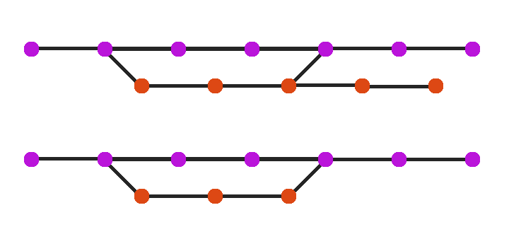
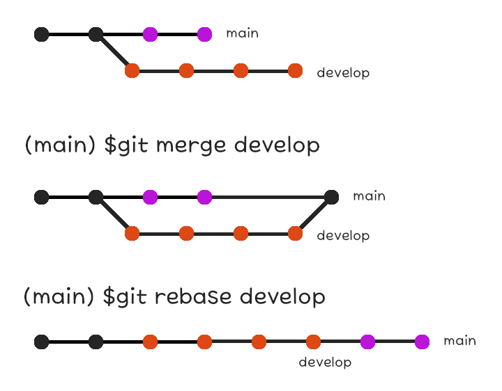

PR과 merge 그리고 rebase
===

branch 합병과 충돌
---

하나의 commit에서 서로 다른 branch로 분기하는 것과 반대로 서로 다른 branch를 합병하여 하나의 commit을 만들 수도 있다.    
이 때, 합병된 두 branch는 다시 제 갈 길을 갈 수도 있고, 하나는 제거하고 다른 하나로만 이어 나갈 수도 있다.



branch의 합병에는 `git merge` 명령어가 사용된다.    
합병하고자 하는 branch에서 합병할 다른 branch를 선택하여 합병한다.

```bash
$ git checkout <Branch Name 0>
$ git merge <Branch Name 1>
```

일반적인 경우 Git은 이 명령어를 통해 파일들을 자동으로 합병한다.    
현재 branch에만 존재하는 파일은 그대로 놔두고 합병 대상 branch에만 존재하는 파일은 해당 branch에 있는 그대로 생성된다.    
수정된 파일에 대해서도 마찬가지다.

동일한 파일이 수정되었을 경우, 수정된 위치가 다르다면 문제되지 않는다.    
예를 들어, branch가 분기되기 전에 다음과 같은 파일이 있었다고 할 때,

```
test file
```

현재 branch에서

```
this is
test file
```

라고 수정하고, 합병 대상 branch에서

```
test file
for Merge
```

라고 수정했다면, 그 합병 결과는 다음과 같다.

```
this is
test file
for Merge
```

그런데 만약 동일한 위치가 수정되었다면 말이 다르다.

```
this is
test file
```

```
just another
test file
```

이 경우 Git은

```
this is
just another
test file
```

인지

```
just another
this is
test file
```

인지    
혹은 둘 중 하나만 남겨 놓고 다른 하나는 무시해야 하는지 알지 못한다.    
이것이 commit log가 다른 경우와 더불어 충돌이 발생하는 또 다른 경우다.

이 경우에는 어렵지 않게 문제를 해결할 수 있다.    
어떻게 하는지 알아보기 위해 간단한 실습을 해보자.

먼저 `develop` branch의 `newfile` 에 문자열을 추가한 후 commit 한다.

```bash
git-example$ git checkout develop
```

파일의 내용은 다음과 같다.

```
test file
```

```bash
git-example$ git add newfile
git-example$ git commit -m "sample file for the merge test"
[develop 54b374d] sample file for the merge test
 1 file changed, 1 insertion(+)
```

그리고 새 branch를 만들어 파일의 내용을 수정한다.
```bash
git-example$ git checkout -b test/merge-0
Switched to a new branch 'test/merge-0'
```

파일의 내용은 다음과 같다.

```
this is
test file
```

```bash
git add newfile
git commit -m "Modify newfile"
[test/merge-0 7f1d00f] Modify newfile
 1 file changed, 1 insertion(+)
```

다시 `develop` branch로 돌아와 이 commit으로부터 새 branch를 만들어 파일의 내용을 수정한다.

```bash
git-example$ git checkout develop 
Switched to branch 'develop'
git-example$ git checkout -b test/merge-1
Switched to a new branch 'test/merge-1'
```

파일의 내용은 다음과 같다.

```
just another
test file
```

```bash
git-example$ git add newfile
git-example$ git commit -m "Modify newfile"
[test/merge-1 40703cb] Modify newfile
 1 file changed, 1 insertion(+)
```

이제 `test/merge-1` branch에 `test/merge-0` branch의 내용을 합병하도록 하겠다.

```bash
git-example$ git merge test/merge-0
Auto-merging newfile
CONFLICT (content): Merge conflict in newfile
Automatic merge failed; fix conflicts and then commit the result.
```

예상대로 충돌이 발생하였다.    
충돌이 발생하였지만 아직 처리되지 않은 파일은 `git status` 명령어를 통해 확인할 수 있다.

```bash
git-example$ git status
On branch test/merge-1
You have unmerged paths.
  (fix conflicts and run "git commit")
  (use "git merge --abort" to abort the merge)

Unmerged paths:
  (use "git add <file>..." to mark resolution)
	both modified:   newfile

no changes added to commit (use "git add" and/or "git commit -a")
```

`git merge --abort` 명령어를 통해 합병을 취소할 수도 있지만 충돌이 발생하였을 경우의 문제 해결 방법을 알아야 하니 취소하지 말고 문제를 해결해보도록 한다.

충돌이 발생하였다는 파일을 열어보면 충돌이 발생한 지점이 다음과 같이 수정되어 있음을 알 수 있다.

```
<<<<<<< HEAD
just another
=======
this is
>>>>>>> test/merge-0
test file
```

`<<<<<<< HEAD` 부터 `=======` 까지는 현재 branch의 내용이고, `=======` 부터 `>>>>>>> test/merge-0` 까지는 합병 대상인 `test/merge-0` branch의 내용이다.

이것을 보고 비교하여 어느 것을 남길지 선택하여 남기고 싶은 부분만 남기고 파일을 저장하면 된다.    
`this is just another test file` 이라는 문자열을 의도했다면 순서를 바꾸고 `<<<<<<< HEAD` 와 같은 메타데이터를 제거하면 된다.

```
this is
just another
test file
```

이 과정이 끝났으면 `git add` 명령어를 통해 수정 사항을 staging area에 올린다.    
그러고나면 모든 충돌이 해결되었음을 알 수 있다.

```bash
git-example$ git add newfile
git-example$ git status
On branch test/merge-1
All conflicts fixed but you are still merging.
  (use "git commit" to conclude merge)

Changes to be committed:
	modified:   newfile
```

합병한 결과를 commit하고 commit log를 찍어보면,

```bash
git-example$ git commit -m "Fix the conflict"
[test/merge-1 4079a7c] Fix the conflict
git-example$ git log --all --oneline --graph 
*   4079a7c (HEAD -> test/merge-1) Fix the conflict
|\  
| * 7f1d00f (test/merge-0) Modify newfile
* | 40703cb Modify newfile
|/  
* 54b374d (develop) sample file for the merge test
* ece91b6 Add newfile
| * 36c7ebb (main) Add newfile
|/  
* fd9efd7 Test modify
* 4172fad modified
* 2671ca0 Initial Commit
```

갈라져 나온 branch가 방금 전의 commit을 통해 다시 합병된 것을 확인할 수 있다.    
`test/merge-0` branch의 내용은 이미 `test/merge-1` branch에 합병되어 이제 제거해도 된다.    
물론 이 branch를 남겨두어도 상관 없지만 연습을 위해 제거해보자.

[이전](chapter04.md)에 branch를 제거하는 방법을 배운 바 있다.

```bash
$ git branch -d <Branch Name>
```

`test/merge-0` branch를 제거하면,

```bash
git-example$ git branch -d test/merge-0
Deleted branch test/merge-0 (was 7f1d00f).
git-example$ git log --all --oneline --graph 
*   4079a7c (HEAD -> test/merge-1) Fix the conflict
|\  
| * 7f1d00f Modify newfile
* | 40703cb Modify newfile
|/  
* 54b374d (develop) sample file for the merge test
* ece91b6 Add newfile
| * 36c7ebb (main) Add newfile
|/  
* fd9efd7 Test modify
* 4172fad modified
* 2671ca0 Initial Commit
git-example$ git branch
  develop
  main
* test/merge-1
```

commit log에서도 branch 목록에서도 더이상 그 이름을 찾아볼 수 없다.

이제 `develop` branch로 돌아가 충돌이 발생하지 않는 경우의 합병을 확인해보자.

```bash
git-example$ git checkout develop 
Switched to branch 'develop'
git-example$ git merge test/merge-1 
Updating 54b374d..4079a7c
Fast-forward
 newfile | 2 ++
 1 file changed, 2 insertions(+)
```

아무 문제 없이 바로 합병이 완료된 것을 확인할 수 있다.    

```bash
git-example$ git log --all --oneline --graph 
*   4079a7c (HEAD -> develop, test/merge-1) Fix the conflict
|\  
| * 7f1d00f Modify newfile
* | 40703cb Modify newfile
|/  
* 54b374d sample file for the merge test
* ece91b6 Add newfile
| * 36c7ebb (main) Add newfile
|/  
* fd9efd7 Test modify
* 4172fad modified
* 2671ca0 Initial Commit
```

지금과 같이 현재 branch가 합병 대상 branch에 비해 선형적으로 앞에 있는 경우가 아니더라도 충돌이 발생하지 않는 경우엔 이와 같이 바로 합병이 이루어진다.

예를 들어, `main` branch의 경우 `develop` branch와 선형적으로 연결되지는 않지만 비어 있는 `main` branch의 `newfile` 에 `develop` branch의 `newfile` 의 내용을 채워 넣는 것으로 합병할 수 있다.    
다만 이 경우에는 branch의 포인터를 그대로 옮겨올 수는 없고 merge commit이라는, 두 branch의 합병을 나타내는 commit을 새로 추가해야 한다.    
따라서 `main` branch에서 `develop` branch에 대한 합병을 시도하면 commit 메시지를 적는 편집기가 열린다.    
기본값을 그대로 두고 commit하면 다음과 같다.

```bash
git-example$ git checkout main 
Switched to branch 'main'
git-example$ git merge develop 
CONFLICT (add/add): Merge conflict in newfile
Auto-merging newfile
Merge made by the 'recursive' strategy.
 newfile | 3 +++
 1 file changed, 3 insertions(+)
git-example$ git log --all --oneline --graph 
*   f1b58b7 (HEAD -> main) Merge branch 'develop' into main
|\  
| *   4079a7c (test/merge-1, develop) Fix the conflict
| |\  
| | * 7f1d00f Modify newfile
| * | 40703cb Modify newfile
| |/  
| * 54b374d sample file for the merge test
| * ece91b6 Add newfile
* | 36c7ebb Add newfile
|/  
* fd9efd7 Test modify
* 4172fad modified
* 2671ca0 Initial Commit
```

여담으로, 앞서 `develop` branch에 `test/merge-1` branch를 합병한 것처럼 commit log가 선형적으로 연결되어 merge commit 없이 합병되는 경우를 Fast Forward 되었다고 하며, Fast Forward가 가능한 상황에도 merge commit을 남기고 싶다면 `--no-ff` 플래그를 설정할 수 있다.

fork와 Pull Request
---

서로 연결된 하나의 저장소를 사용할 땐 지금까지 다룬 내용으로 충분하다.    
그런데 실제 프로젝트에서는 더 많은 저장소가 상호작용한다.    

일반적인 프로젝트 관리는 다음과 같다.    
먼저 어떤 프로젝트가 있을 때, Git 호스팅 업체의 웹사이트에서 그 프로젝트 저장소를 복제하여 개인 저장소를 만든다.    

예를 들어 [neont21](https://github.com/neont21)라는 사용자가 [GitHub의 RustPython/RustPython](https://github.com/RustPython/RustPython)을 복제해 [개인 저장소 neont21/RustPython](https://github.com/neont21/RustPython)를 만든다.

그 후 사용자는 개인 PC에 Git 호스팅 업체 웹사이트의 개인 저장소를 remote 저장소로 한 local 저장소를 만들고 그곳에서 작업을 한 뒤 push 한다.

그리고 작업이 완료되었다면 개인 저장소의 내용을 원래의 프로젝트 저장소에 반영할 수 있도록 요청한다.

이 때, 저장소를 복제하는 것을 fork, 변동사항을 반영하도록 요청하는 것을 Pull Request라고 한다.

fork는 Git 호스팅 업체 웹사이트의 프로젝트 저장소에서 `Fork` 버튼을 통해 수행할 수 있으며, 해당 프로젝트와 동명의 저장소가 자신의 저장소 목록에 추가된다.    
이것은 fork 한 그 순간의 상태를 복제해오므로 시간이 지남에 따라 원본 저장소에 commit이 쌓이면 두 저장소의 내용은 달라질 수 있다.

일반적으로 원본 저장소는 `upstream` 이라는 이름의 remote 저장소로 등록해놓고, 필요에 따라 fetch 또는 pull로 최신 상태를 내려 받는다.

Pull Request 또한 Git 호스팅 업체 웹사이트에서 수행할 수 있다.    
업체에 따라 Merge Request 등 다른 이름을 가지고 있을 수도 있지만 말이다.

이 때 주의할 점은 내가 fork 후 작업하는 사이에 원본 저장소에 새 commit이 추가되었을 수 있다는 점이다.    
이 경우 앞서 배운 `git merge` 를 통해 합병할 수도 있지만 잠시 후 다룰 `git rebase` 를 통해 합병하는 것이 더 깔끔할 수 있다.

Pull Request를 보낼 땐 무엇이 수정되었는지 설명하는 메시지를 작성한다.    
commit 할 때는 간단하게 적었지만 여기에서는 그 모든 commit을 전체적으로 설명하는 내용이 있어야 한다.    
이 때, "어떻게" 보다는 "무엇을"과 "왜"가 중요하다.    
"~에 ~라는 버그가 있어 ~하게 수정했습니다"라는 식의 메시지가 있어야 하며 그 방법에 대한 설명은 굳이 필요하지 않다.

프로젝트에 따라 Contribution License Agreement에 서명을 해야 Pull Request를 할 수 있다거나 Pull Request 후 자동으로 정적 분석 등을 수행하여 이를 통과한 경우에만 리뷰 및 승인을 하는 경우도 있다는 것은 여담.    
모든 commit에 서명이 포함되어야만 승인해주는 경우도 있는데 서명에 대해서는 [다음 시간](chapter07.md)에 알아보도록 하겠다.

경우에 따라서는 fork 하지 않고 저장소를 다른 사람과 공유하는 경우도 있다.    
이를 위해서는 Git 호스팅 업체 웹사이트의 해당 저장소 설정 페이지에서 협업을 할 사람을 contributor로 등록하여 push 권한을 부여해야 한다.    
이와 같이 작업할 때 주의할 점은 내가 pull 한 이후 다른 사람이 동일 branch에 push 하였는지 확인하는 것이다.    
push 하려고 했는데 그 전에 다른 사람이 push를 하였다면 충돌이 발생할 수 있다.    
이러한 충돌은 remote 저장소가 아닌 local 저장소에서 처리해야 하기 때문에 먼저 pull 하여 충돌을 처리하고 나서 push 한다.    
저장소를 공유하는 경우에는 항상 pull 하고 나서 push를 하는 습관을 들이도록 하자.

rebase
---

rebase는 base를 재설정하는 것으로, base란 fork한 원본 저장소로부터 가져온 commit을 의미한다.    
fork한 시점으로부터 어느 정도 시간이 지나 원본 저장소에 commit이 추가적으로 생성되었을 때 그냥 Pull Request를 하면 commit log가 달라 동일 branch에 대한 서로 다른 log가 생기므로 충돌이 발생하는데, 이를 방지하기 위해 필요한 기술이다.

라고 하지만, Pull Request 할 때뿐만 아니라 두 개의 branch를 합병할 때도 사용할 수 있다.    
충돌이 발생하지 않는 두 개의 branch를 선형적으로 연결하고자 할 때 사용된다.



rebase를 사용하면 merge commit을 하지 않고 보다 깔끔한 commit log를 남길 수 있다.    
이 때, 이미 push 되어 remote 저장소에 있는 부분에 대해 rebase 하지 않도록 주의하자.    
그렇게 할 경우 remote 저장소의 commit log를 덮어씌우기 위해 `git push --force` 를 해야 하며, 다른 사람의 작업에 영향을 줄 수 있다.    
아직 remote 저장소에 반영하지 않은, local 저장소에 있는 내용에 대해서만 rebase를 통해 commit log를 정리하도록 하자.

commit 수정하기
---

이 내용도 rebase와 마찬가지로 rebase 저장소에 반영된 부분에 적용하기 위해서는 `git push --force` 를 해야 하며, 이에 따라 commit log가 변경되어 다른 사람의 작업에 영향을 줄 수 있어 주의해야 한다.     

commit 할 때 메시지에 오타가 났다거나 파일 하나를 빼먹은 것과 같은 작은 실수를 했을 경우, 이를 반영하기 위한 새 commit을 하기엔 commit log가 지저분해질 수 있다.    
파일 누락은 지저분해 보이더라도 그렇게 한다고 쳐도 오타 같은 경우에는 이와 같은 방법으로 수습할 수 없다.    
이런 경우에 사용할 수 있는 게 commit 수정이다.

가장 마지막으로 한 commit을 수정하기 위해서는 `--amend` 플래그를 사용할 수 있다.

누락된 파일이 있다면 그것을 추가한 후 다음 명령어를 수행한다.

```bash
$ git commit --amend -m "<Commit Message>"
```

오타가 있었을 경우에도 여기서 메시지를 잘 입력하여 수정할 수 있다.    
만약 기존의 메시지를 그대로 사용하고 싶다면 `git commit --amend` 까지만 하면 된다.    
이 경우 편집기가 뜨며 Commit 메시지가 뜨는데 여기서 아무것도 수정하지 않으면 기존 메시지대로 commit 된다.
물론 메시지를 수정하고 싶은 경우에도 이 방식으로 편집기에서 수정해도 무방하다.

가끔 commit log를 출력해보고 뒤늦게 오래 전의 오타를 발견하는 등 과거의 commit을 수정해야 할 때가 있을 수 있다.    
이 경우 과거의 commit으로 돌아가 `git commit --amend` 를 해야 한다.    
과거의 commit으로 돌아가기 위해서는 `HEAD` 가 가리키는 commit을 이전의 commit으로 돌려야 하는데, 이를 위해서는 `git rebase -i` 명령어를 사용할 수 있다.    
`git rebase -i` 명령어를 통해 특정 commit 이후의 commit으로 이동할 수 있는데, 입력한 해당 commit은 포함하지 않는다는 점을 유의하자.

```
$ git rebase -i <Commit Hash>
```

예를 들어 다음과 같은 commit log에서

```bash
git-example$ git log --all --oneline --graph 
*   6e8ede2 (HEAD -> main) Merge branch 'develop' to 'main'
|\  
| *   4079a7c (test/merge-1, develop) Fix the conflict
| |\  
| | * 7f1d00f Modify newfile
| * | 40703cb Modify newfile
| |/  
| * 54b374d sample file for the merge test
| * ece91b6 Add newfile
* | 36c7ebb Add newfile
|/  
* fd9efd7 Test modify
* 4172fad modified
* 2671ca0 Initial Commit
```

`4172fad` 이후의 commit을 수정하고자 한다면

```bash
git-example$ git rebase -i 4172fad
```

을 입력하면 편집기에 다음과 같이 출력되는 것을 확인할 수 있다.

```
pick fd9efd7 Test modify
pick 36c7ebb Add newfile
pick ece91b6 Add newfile
pick 54b374d sample file for the merge test
pick 40703cb Modify newfile
pick 7f1d00f Modify newfile

# Rebase 4172fad..6e8ede2 onto 54b374d (6 commands)
#
# Commands:
# p, pick <commit> = use commit
# r, reword <commit> = use commit, but edit the commit message
# e, edit <commit> = use commit, but stop for amending
# s, squash <commit> = use commit, but meld into previous commit
# f, fixup <commit> = like "squash", but discard this commit's log message
# x, exec <command> = run command (the rest of the line) using shell
# b, break = stop here (continue rebase later with 'git rebase --continue')
# d, drop <commit> = remove commit
# l, label <label> = label current HEAD with a name
# t, reset <label> = reset HEAD to a label
# m, merge [-C <commit> | -c <commit>] <label> [# <oneline>]
# .       create a merge commit using the original merge commit's
# .       message (or the oneline, if no original merge commit was
# .       specified). Use -c <commit> to reword the commit message.
#
# These lines can be re-ordered; they are executed from top to bottom.
#
# If you remove a line here THAT COMMIT WILL BE LOST.
#
# However, if you remove everything, the rebase will be aborted.
#
# Note that empty commits are commented out
```

여기엔 commit log를 출력했던 것과 역순으로 commit이 출력되는 것을 확인할 수 있다.    
이 목록에서 수정하고자 하는 commit을 선택하여 그 옆의 `pick` 을 `edit` 으로 수정 후 저장한다.

```
pick fd9efd7 Test modify
edit 36c7ebb Add newfile
pick ece91b6 Add newfile
pick 54b374d sample file for the merge test
pick 40703cb Modify newfile
pick 7f1d00f Modify newfile

# Rebase 4172fad..6e8ede2 onto 54b374d (6 commands)
#
# Commands:
# p, pick <commit> = use commit
# r, reword <commit> = use commit, but edit the commit message
# e, edit <commit> = use commit, but stop for amending
# s, squash <commit> = use commit, but meld into previous commit
# f, fixup <commit> = like "squash", but discard this commit's log message
# x, exec <command> = run command (the rest of the line) using shell
# b, break = stop here (continue rebase later with 'git rebase --continue')
# d, drop <commit> = remove commit
# l, label <label> = label current HEAD with a name
# t, reset <label> = reset HEAD to a label
# m, merge [-C <commit> | -c <commit>] <label> [# <oneline>]
# .       create a merge commit using the original merge commit's
# .       message (or the oneline, if no original merge commit was
# .       specified). Use -c <commit> to reword the commit message.
#
# These lines can be re-ordered; they are executed from top to bottom.
#
# If you remove a line here THAT COMMIT WILL BE LOST.
#
# However, if you remove everything, the rebase will be aborted.
#
# Note that empty commits are commented out
```

그러고나면 `HEAD` 가 해당 commit으로 이동한다.

```bash
git-example$ git log --all --oneline --graph 
*   6e8ede2 (main) Merge branch 'develop' to 'main'
|\  
| *   4079a7c (test/merge-1, develop) Fix the conflict
| |\  
| | * 7f1d00f Modify newfile
| * | 40703cb Modify newfile
| |/  
| * 54b374d sample file for the merge test
| * ece91b6 Add newfile
* | 36c7ebb (HEAD) Add newfile
|/  
* fd9efd7 Test modify
* 4172fad modified
* 2671ca0 Initial Commit
```

이제 이 commit에서 수정할 것이 있으면 `git commit --amend` 를 통해 수정하면 된다.    
수정이 완료되었으면 다음 명령어를 통해 `HEAD` 를 원래의 위치로 돌릴 수 있다.

```bash
$ git rebase --continue
```

만약 수정 도중 이 작업을 취소하고 싶다면 `git rebase --abort` 를 할 수 있는데, `git rebase --continue` 를 하기 전에만 유효하다.

이걸로 Git을 사용하기 위한 기본적인 기술을 모두 익혔다.(아마도?)    
마지막으로 commit에 서명을 하는 방법을 알아보도록 하자.    
[>>> 07. 내 commit에 서명하기](chapter07.md)
