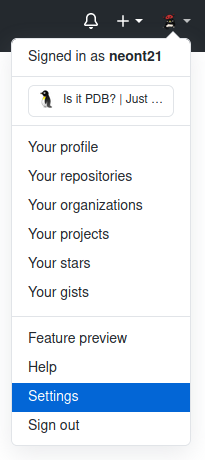
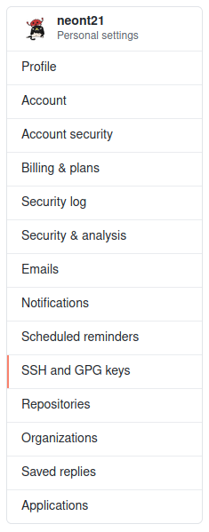
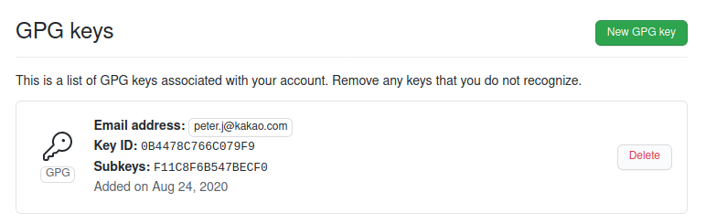

내 commit에 서명하기
===

~~[피터의 블로그](https://velog.io/@peeeeeter_j/GitHub에-GPG-key-등록하기)를 참고할 것―이라 하고 싶지만 너무 무성의한 것 같아 제대로 작성한다.~~    
~~사실 그 포스팅은 Windows 사용자를 고려하지 않았는데 여러분 중엔 Windows 사용자가 많을 것 같아서...ㅋㅋ~~

Git 호스팅 업체 웹사이트에 있는 프로젝트 저장소의 commit log를 보면 `Verified` 라는 문구가 써있는 것을 볼 수 있는 경우가 있다.    
이것은 해당 commit이 GPG key를 통해 서명되었음을 명시한다.

GPG, 또는 GnuPG라고 불리는 것은 GNU Privacy Guard의 줄임말로, 양방향 암호화에 사용되는 표준이다.    
양방향 암호화는 모두에게 공개되는 public key와 혼자만 알고 있는 private key를 이용한 암호화 방식으로, 자세한 내용은 [구글](https://www.google.com/search?q=양방향+암호화)에게 물어보도록 하자.

GPG key 생성하기
---

GPG key를 생성하는 방법은 운영체제에 따라 차이가 있지만 하나씩 알아보도록 하자.    
사전 순으로 Linux/Mac/Windows 순서로 설명할텐데 자신의 운영체제 외의 것은 무시하고 넘어가도 좋다.

### Linux 또는 Mac에서 GPG key 생성하기

GPG Key 생성에는 gpg 명령어가 사용되는데 이를 위해서는 gnupg 패키지가 필요하다.    
이것이 존재하지 않는다면 설치해주어야 한다.

Debian 계열의 Linux에서는 다음과 같은 명령어로 설치하며

```bash
$ sudo apt install gnupg
```

RedHat 계열의 Linux에서는 다음과 같은 명령어로 설치하고

```bash
$ sudo yum install gnupg
```

Mac에서는 다음과 같은 명령어로 설치한다.

```bash
brew install gpg
```

그리고 이하 내용은 모든 Linux 배포판과 Mac에서 동일하다.    
~~그렇다. Windows만 다른 것이었다!~~    
~~라기보다 UNIX-like OS 끼리 유사하다는 게 맞는 말이지만... 이 이야기는 무시하고 넘어가도록 하자.~~

자신의 홈 디렉토리에 `.gnupg/gpg.conf` 라는 파일이 없다면 새로 생성하고 있다면 맨 아래 다음과 같은 내용을 추가한다.

```
personal-digest-preferences SHA512
cert-digest-algo SHA512
default-preference-list SHA512 SHA384 SHA256 SHA224 AES256 AES192 AES CAST5 ZLIB BZIP2 ZIP Uncompressed
```

그리고 다음과 같은 명령어로 GPG key를 생성할 수 있다.

```bash
$ gpg --full-generate-key
```

몇 가지 선택지에 답변을 해야 하는데, 먼저 암호화 방식을 물어본다.

```
Please select what kind of key you want:
   (1) RSA and RSA (default)
   (2) DSA and Elgamal
   (3) DSA (sign only)
   (4) RSA (sign only)
Your selection?
```

암호화와 복호화 모두 RSA 방식을 사용하도록 한다.    
`1` 을 입력하고 엔터를 치거나, 그냥 엔터를 치면 기본값인 `1` 로 설정된다.

그리고 암호의 bit 수를 설정하라고 하는데 이것은 짧을수록 취약하니 길게 설정하자.

```
RSA keys may be between 1024 and 4096 bits long.
What keysize do you want? (3072)
```

`4096` 을 입력하고 엔터를 치면 된다.

그러고 나면 key의 유효 기간을 설정하라고 하는데 약 2년 정도를 권장한다.

```
Please specify how long the key should be valid.
         0 = key does not expire
      <n>  = key expires in n days
      <n>w = key expires in n weeks
      <n>m = key expires in n months
      <n>y = key expires in n years
Key is valid for? (0)
```

따라서 `2y` 라고 입력하고 엔터를 친다.

마지막으로 개인 신원을 입력하라는 문항이 나온다.

```
You need a user ID to identify your key; the software constructs the user ID
from the Real Name, Comment and Email Address in this form:
    "Heinrich Heine (Der Dichter) <heinrichh@duesseldorf.de>"

Real name: 
Email address: 
Comment: 
```

Comment는 생략 가능하고, 실명과 자주 쓰는 이메일을 사용하도록 하자.    
정확히는, Git에 설정한 것과 동일한 이메일을 사용해야 불필요한 오류를 피할 수 있다.

마지막으로 입력한 신원 정보의 일치 여부를 확인하라고 하는데 문제가 없다면 Okay의 약자인 `o` 를 입력한다.    
비밀번호를 요구할 경우 GPG key와 함께 사용할 비밀번호를 입력한다.    
이것은 GPG key의 private key를 사용할 때 필요할 수 있으니 잊어버리지 말도록 하자.

key 생성에는 random byte가 필요한데 PC의 log data로부터 random byte를 얻어오므로 오래 걸릴 경우 다른 걸 하다 돌아오면 어느 순간 완료되어 있을 것이다.

자, 이제 성공적으로 GPG key가 생성되었다면 40개의 문자 또는 숫자로 이루어진 문자열이 뜰 것이다.    
이 40자리 문자열을 핑거프린트(fingerprint)라고 부르며 마지막 8자리를 KeyID라고 부른다.

핑거프린트는 다음 명령어를 통해서도 확인할 수 있다.

```bash
$ gpg --fingerprint
```

마지막으로 "이게 내 public key요" 하는 것을 세상에 알리는 작업이 필요하다.    
여러 가지 key server 중 한 군데에 자신의 public key를 올리면 정기적으로 서로 연동된다고 한다.    
적당히 [keyserver.ubuntu.com](https://keyserver.ubuntu.com)를 사용하도록 하자.

다음과 같은 명령어를 통해 등록할 수 있다.

```bash
$ gpg --keyserver <Key Server URL> --send-keys <KeyID or Fingerprint>
```

예를 들어 자신의 KeyID가 `66C079F9` 라면

```bash
$ gpg --keyserver keyserver.ubuntu.com --send-keys 66C079F9
```

라고 하면 된다.

### Windows에서 GPG key 생성하기
~~이 글을 작성하고 있는 이는 아래 내용을 직접 해본 적 없음을 밝힌다;;~~    
~~Windows는... 사실 익숙치 않습니닼ㅋ;;~~    

[GPG4Win](https://www.gpg4win.org/index.html) 프로그램을 내려받아 설치한다.    
후원하라는 내용은 무시하고 `$0` 을 선택하여 다운로드 할 수 있다.

프로그램을 열고 `New Key Pair` 버튼을 누른다.

`Name` 과 `EMail` 에 실명과 자주 쓰는 이메일을 입력한다.    
정확히는, Git에 설정한 것과 동일한 이메일을 사용해야 불필요한 오류를 피할 수 있다.

`다음` 으로 넘어가기 전에, `Advanced Settings...` 를 클릭한다.    
`Key Material` 에 `RSA` 를 선택하고 `+ RSA` 체크박스도 체크한 뒤 둘 모두 `4096 bits` 로 설정한다.    
그리고 `Valid until` 을 현 시점으로부터 2년 후로 설정한다.    
(꼭 2년일 필요는 없긴 하지만 권장 사항이다.)    

`확인` 버튼을 누르고 `다음` 으로 넘어가면 입력한 정보를 확인할 수 있는데 문제가 없다면 `Create` 버튼을 누른다.

비밀번호를 요구할 경우 GPG key와 함께 사용할 비밀번호를 입력한다.
이것은 GPG key의 private key를 사용할 때 필요할 수 있으니 잊어버리지 말도록 하자.

그러고나면 40자리 문자 또는 숫자로 이루어진 핑거프린트(fingerprint)가 생성된 것을 알 수 있다.    
이것의 하위 8자리를 KeyID라고 부른다는 것도 알아두자.

마지막으로 "이게 내 public key요" 하는 것을 세상에 알리는 작업이 필요하다.    
여러 가지 key server 중 한 군데에 자신의 public key를 올리면 정기적으로 서로 연동된다고 한다.    
적당히 [keyserver.ubuntu.com](https://keyserver.ubuntu.com)를 사용하도록 하자.    

상단 메뉴바의 `설정` > `Kleopatra 설정` 으로 이동하여 `OpenPGP Keyserver` 에 key server 주소, 즉 `keyserver.ubuntu.com` 를 입력한다.    
그리고 여기에 올릴 항목을 우클릭 한 후 `Publish on Server` 를 누르면 업로드 된다.

Git 호스팅 업체 웹사이트에 등록하기
---

GitLab, BitBucket 등의 호스팅 업체도 있지만 GitHub을 기준으로 설명하도록 하겠다.    
우리 동아리 Git 저장소는 GitHub에 있으니 말이다.    
다른 호스팅 업체도 크게 다르지 않을 것이다.

먼저 GitHub에 로그인 한 후 우측 상단 메뉴에서 `Settings` 버튼을 클릭한다.



설정 메뉴 중 `SSH and GPG keys` 라는 것이 있을 것이다.



그곳에 들어가 `New GPG key` 버튼을 누르면 GPG key를 등록할 수 있다.


`-----BEGIN PGP PUBLIC KEY BLOCK-----` 로 시작하는 무언가를 입력하라는 것을 확인할 수 있다.    
이것은 `gpupg` 패키지를 통해 구할 수 있다.

```bash
$ gpg --armor --export <KeyID or Fingerprint>
-----BEGIN PGP PUBLIC KEY BLOCK-----
// 내용은 생략
-----END PGP PUBLIC KEY BLOCK-----
```

(Windows에서도 `GPG4Win` 을 설치할 때 cmd 창에서 사용할 수 있는 패키지가 설치되었기에 cmd 창을 열고 똑같이 입력하면 된다.)    
~~라기 보다, 사실 GUI 상에서 하는 방법을 못찾았다;;ㅋㅋㅋㅋ큐ㅠ~~

이것을 내용뿐만 아니라 앞뒤 `-----` 부분까지 복사해 넣은 후 `Add GPG key` 버튼을 누른다.    
그러면 다음과 같이 GPG key가 추가된 것을 확인할 수 있다.



commit에 서명하기
---

마지막으로 본격적으로 commit에 서명하는 방법을 알아보자.    
commit에 서명을 하기 위해서는 설정 파일에 GPG key를 등록해야 한다.

```bash
$ git config --global user.signingkey <KeyID or Fingerprint>
```

잘 설정되었다면 이제 commit 시 `-S` (대문자다) 을 추가하여 서명을 할 수 있다.    
(만약 여기서 오류가 발생한다면 오타가 나지 않았는지 살펴보자.)    
(설정된 이메일에 차이가 있어도 오류가 발생할 수 있다.)

commit에 서명을 한 것은 `git log` 에 `--show-signature` 플래그를 설정해 확인할 수 있다.

매번 commit할 때마다 플래그를 설정하기 귀찮다면 항상 자동으로 서명하도록 설정할 수도 있다.

```bash
$ git config --global commit.gpgsign true
```

GPG key 옮기기
---

PC를 변경하는 등의 이유로 GPG key를 옮겨야 할 상황이 발생할 수 있다.
그럴 땐 다음과 같은 명령어로 내보낼 수 있다.

```bash
$ gpg --output <Public Key Name>.gpg --armor --export <KeyID or Fingerprint>
$ gpg --output <Private Key Name>.gpg --armor --export-secret-key <KeyID or Fingerprint>
```

key 이름은 본인이 알아볼 수 있는 것으로 적당히 설정하면 된다.    
private key를 내보낼 땐 GPG key 생성 시 사용했던 비밀번호를 요구할 수 있다.

이제 이 key들을 다른 PC에 옮긴 후, `gpung` 패키지 혹은 `GPG4Win` 프로그램이 설치된 상태에서 다음 명령어를 실행한다.

```bash
$ gpg --import <Public Key Name>.gpg
$ gpg --allow-secret-key-import --import <Private Key Name>.gpg
```

파일을 찾지 못한다면 `./` 를 앞에 붙이는 등 경로를 명시해주자.

잘 옮겨졌다면 핑거프린트를 확인할 수 있을 것이다.

```bash
$ gpg --fingerprint
```

복제를 마친 후에는 유축 방지를 위해 내보내기 했던 파일들을 제거하도록 하자.
